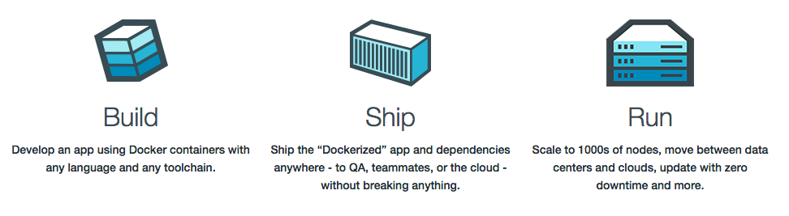

# 5 - Build / Ship / Run

Build / Ship and Run phases must be kept separated



A release is deployed on the execution environment and must be immutable.

## What does that mean for our application ?

We'll use Docker in the whole development pipeline. We will start by adding a Dockerfile that will define the build phase for each service (during which the dependencies are compiled). As an example, here is the Dockerfile for the vote service:


```python
# Using official python runtime base image
FROM python:2.7-alpine

# Set the application directory
WORKDIR /app

# Install our requirements.txt
ADD requirements.txt /app/requirements.txt
RUN pip install -r requirements.txt

# Copy our code from the current folder to /app inside the container
ADD . /app

# Make port 80 available for links and/or publish
EXPOSE 80

# Define our command to be run when launching the container
CMD ["gunicorn", "app:app", "-b", "0.0.0.0:80", "--log-file", "-", "--access-logfile", "-", "--workers", "4", "--keep-alive", "0"]

```

Let's build our application `$ docker build -t examplevotingapp_vote:v1 .`

And verify the resulting image is in the list of available images

```
$ docker images
REPOSITORY                TAG           IMAGE ID           CREATED             SIZE
examplevotingapp_vote     v1            f35464cf4b0b       2 seconds ago       29 MB
```

Now the image (build) is available, execution environment must be injected to create a release.

There are several options to inject the configuration in the build, among them
* create a new image based on the build
* define a Compose file

We'll go for the second option and define a docker-compose file where the DB_HOST and PORT will be set with the value of the execution environment

```yaml
version: "3"

services:
  vote:
    build: ./vote
    command: python app.py
    volumes:
     - ./vote:/app
    ports:
      - "5000:80"
    networks:
      - front-tier
      - back-tier

  result:
    build: ./result
    command: nodemon server.js
    environment:
      - DB_HOST=postgres://postgres@db/postgres
      - PORT=4000
    volumes:
      - ./result:/app
    ports:
      - "5001:80"
      - "5858:5858"
    networks:
      - front-tier
      - back-tier

  worker:
    build:
      context: ./worker
      dockerfile: Dockerfile.j
    networks:
      - back-tier

  redis:
    image: redis:alpine
    container_name: redis
    ports: ["6379"]
    networks:
      - back-tier

  db:
    image: postgres:9.4
    container_name: db
    volumes:
      - "db-data:/var/lib/postgresql/data"
    networks:
      - back-tier

volumes:
  db-data:

networks:
  front-tier:
  back-tier:
```

The run phase can be done manually with Compose CLI or through an orchestrator such as Docker Swarm or Kubernetes in Docker Enterprise Edition.

The Compose CLI can run the application using `docker-compose up -d`

[Previous](04_external_services.md) - [Next](06_processes.md)
