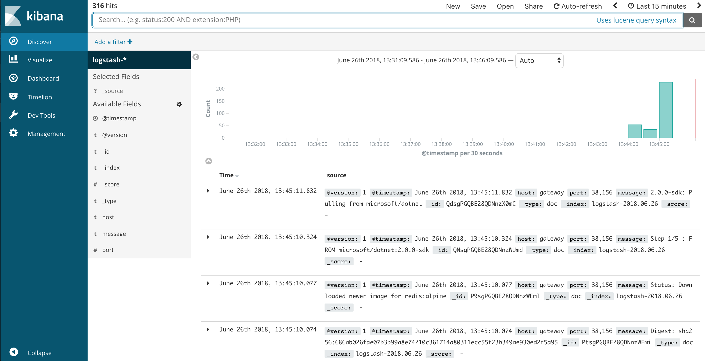

# 11 - Logs

Logs need to be handled as a timeseries of textual events

The application should not handle or save logs locally but must write them in stdout / stderr.

A lot of services offer a centralized log management ([Elastic Stack / ELK](https://www.elastic.co/products) , [Splunk](http://splunk.com), [Logentries](https://logentries.com), ...), and most of them are very easily integrated with Docker.

Example of Kibana dashboard:



## What does that mean for our application ?

Docker writes log information to stdout. Setting up logging can be as simple as:

1. Using Docker Compose to deploy an ELK stack.

  ```yml
  version: '3.5'

  services:

    elasticsearch:
      build:
        context: elasticsearch/
      volumes:
        - ./elasticsearch/config/elasticsearch.yml:/usr/share/elasticsearch/config/elasticsearch.yml:ro
      ports:
        - "9200:9200"
        - "9300:9300"
      environment:
        ES_JAVA_OPTS: "-Xmx256m -Xms256m"
      networks:
        - elk

    logstash:
      build:
        context: logstash/
      volumes:
        - ./logstash/config/logstash.yml:/usr/share/logstash/config/logstash.yml:ro
        - ./logstash/pipeline:/usr/share/logstash/pipeline:ro
      ports:
        - "5002:5000"
      environment:
        LS_JAVA_OPTS: "-Xmx256m -Xms256m"
      networks:
        - elk
      depends_on:
        - elasticsearch

    kibana:
      build:
        context: kibana/
      volumes:
        - ./kibana/config/:/usr/share/kibana/config:ro
      ports:
        - "5601:5601"
      networks:
        - elk
      depends_on:
        - elasticsearch

  networks:

    elk:
      driver: bridge
  ```

2. Creating an index in Elasticsearch

```bash
curl -X POST  \
 -H "Content-Type: application/json" \
 -H "kbn-version: 6.2.3" \
 -d '{"attributes":{"title":"logstash-*","timeFieldName":"@timestamp"}}' \  "http://localhost:5601/api/saved_objects/index-pattern"
```

3. Using netcat to pipe the log from stdout to Elasticsearch

```bash
cd ./example-voting-app
docker-compose up | nc localhost 5002
```
In practice, you would use to a [logging-driver](https://docs.docker.com/config/containers/logging/configure/#configure-the-default-logging-driver) to configure logging for the application and individual services.

[Previous](10_dev_prod_parity.md) - [Next](12_admin_processes.md)
